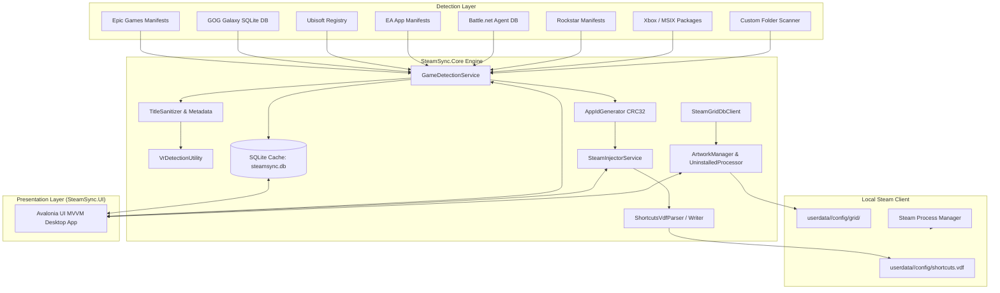

# SteamSync

[](https://dotnet.microsoft.com/)
[](https://avaloniaui.net/)
[](https://docs.microsoft.com/en-us/dotnet/csharp/)
[](https://www.sqlite.org/)
[](https://xunit.net/)
[](https://www.microsoft.com/windows)

**SteamSync** is a high-performance Windows desktop application and class library designed to automatically discover installed and owned games across major third-party launchers and custom directories, fetch high-resolution artwork from SteamGridDB, and inject them as Non-Steam shortcuts into your local Steam client.

---

## Table of Contents
- [Overview](#overview)
- [Key Features](#key-features)
- [Architecture & Workflow](#architecture--workflow)
- [Supported Storefronts & Integrations](#supported-storefronts--integrations)
- [Technical Deep Dive](#technical-deep-dive)
  - [AppID Generation Algorithm](#appid-generation-algorithm)
  - [Binary shortcuts.vdf Manipulation](#binary-shortcutsvdf-manipulation)
  - [Artwork Pipeline & Uninstalled Overlay](#artwork-pipeline--uninstalled-overlay)
  - [Custom Folder Scanner & Title Sanitization](#custom-folder-scanner--title-sanitization)
- [Repository Structure](#repository-structure)
- [Getting Started](#getting-started)
  - [Prerequisites](#prerequisites)
  - [Running the Pre-built Release](#running-the-pre-built-release)
  - [Building from Source](#building-from-source)
  - [Running Tests](#running-tests)
- [Configuration](#configuration)
- [Subdirectory Documentation](#subdirectory-documentation)
- [Acknowledgements & References](#acknowledgements--references)

---

## Overview

Modern PC gamers often have their game libraries fragmented across multiple storefronts (Epic Games, GOG Galaxy, Ubisoft Connect, EA App, Battle.net, Rockstar Games, Xbox) as well as standalone, DRM-free, or emulation directories. 

SteamSync provides a unified solution:
1. **Automated Discovery:** Scans system registries, launcher manifests, local databases, and custom folders to locate games without requiring heavy launcher clients to be running.
2. **Artwork Resolution:** Queries the [SteamGridDB API](https://www.steamgriddb.com/) to automatically download vertical cover posters, wide heroes, transparent logos, and square icons.
3. **Steam Shortcut Injection:** Safely parses, updates, and serializes Steam's binary `shortcuts.vdf` files, generating standard BoilR-compatible 64-bit Non-Steam AppIDs.
4. **State Management & Uninstalled Overlays:** Tracks installed vs. owned games, optionally creating desaturated/grayscale artwork overlays with an "UNINSTALLED" badge so uninstalled titles can remain visible and accessible in your Steam library.

---

## Key Features

- **Multi-Storefront Support:** Built-in auto-detectors for Epic Games, GOG Galaxy, Ubisoft Connect, EA App, Battle.net, Rockstar Games Launcher, and Xbox / Windows Store.
- **Smart Custom Folder Scanner:** Heuristic file-system scanner that ignores setup/engine utilities (`unins000.exe`, `UnityCrashHandler.exe`, `dxsetup.exe`), extracts metadata from Windows PE headers (`FileVersionInfo`), and sanitizes release titles.
- **SteamGridDB Integration:** Automatic asset resolution and downloading for vertical grids (`<appId>p.png`), horizontal banners (`<appId>.png`), heroes (`<appId>_hero.png`), logos (`<appId>_logo.png`), and icons (`<appId>_icon.png`).
- **VR Compatibility Detection:** Heuristically detects OpenVR/OpenXR dependencies and SteamVR manifests to flag VR titles and toggle Steam's native VR library inclusion (`OpenVR = 1`).
- **Safe Process Management & Force Sync:** Offers graceful or rapid force-restart of Steam to flush file locks and ensure shortcut/artwork updates take effect immediately.
- **Non-Destructive VDF Updates:** Preserves existing user-created Steam shortcuts while managing and syncing SteamSync-tagged entries.
- **Modern Avalonia UI:** Responsive dark-mode interface built with Avalonia UI (Fluent theme) and `CommunityToolkit.Mvvm`, featuring real-time logging, sorting, filtering, and selection controls.

---

## Architecture & Workflow

SteamSync is structured into modular components separating detection, data persistence, Steam file I/O, artwork management, and user interface presentation.



---

## Supported Storefronts & Integrations

| Storefront / Source | Detection Method | Installed Detection | Owned Tracking |
| :--- | :--- | :---: | :---: |
| **Epic Games** | Parses `.item` manifests in `%ProgramData%\Epic\EpicGamesLauncher\` | 🟢 **Supported** | 🟢 **Supported** |
| **GOG Galaxy** | Queries SQLite DB at `%ProgramData%\GOG.com\Galaxy\storage\galaxy-2.0.db` | 🟢 **Supported** | 🟢 **Supported** |
| **Ubisoft Connect** | Reads Windows Registry & local launcher configuration | 🟢 **Supported** | 🟢 **Supported** |
| **EA App** | Reads installer manifests in `%ProgramData%\Electronic Arts\EA Desktop\` | 🟢 **Supported** | 🟢 **Supported** |
| **Battle.net** | Reads Battle.net product databases and agent state files | 🟢 **Supported** | 🟢 **Supported** |
| **Rockstar Games** | Reads launcher manifests and local titles database | 🟢 **Supported** | 🟢 **Supported** |
| **Xbox / Windows Store** | Scans UWP / MSIX application packages via Windows Gaming Services | 🟢 **Supported** | 🔴 **Unsupported** *(Installed only)* |
| **Custom Scan Folders** | Recursive heuristic directory scanner with regex title cleaning & PE inspection | 🟢 **Supported** | ⚪ **N/A** *(File scan only)* |

> [!NOTE]
> - **Installed Detection:** Discovers games currently downloaded on local drives and automatically locates their target executables.
> - **Owned Tracking:** Discovers uninstalled titles tied to your storefront accounts, enabling Steam shortcut injection with optional grayscale artwork and uninstalled badges.
> - **Xbox Limitation:** Xbox / Windows Store integration operates locally on installed MSIX packages; uninstalled cloud/account entitlements require interactive Microsoft OAuth authentication and are not currently tracked.
> - **Custom Folders:** Custom directories scan local file systems directly, where account ownership tracking is not applicable (N/A).

---

## Technical Deep Dive

### AppID Generation Algorithm
To ensure compatibility with BoilR and Steam's Non-Steam shortcut specification, SteamSync calculates 32-bit and 64-bit AppIDs using CRC32 hashing over the target executable path and game title:

```csharp
// 1. Calculate CRC32 of exe path + title
uint crc = Crc32.Compute($"{exePath}{appName}");

// 2. Set the top bit (0x80000000)
uint shortAppId = crc | 0x80000000;

// 3. Construct 64-bit Steam ID with Non-Steam type flag (0x02000000)
ulong fullAppId = ((ulong)shortAppId << 32) | 0x02000000;
```

### Binary shortcuts.vdf Manipulation
Steam stores Non-Steam shortcuts in binary KeyValues (VDF) format located at:
`userdata/<user_id>/config/shortcuts.vdf`

SteamSync provides a custom binary parser ([ShortcutsVdfParser.cs](file:///d:/projects/SteamSync/src/SteamSync.Core/Steam/ShortcutsVdfParser.cs)) and writer ([ShortcutsVdfWriter.cs](file:///d:/projects/SteamSync/src/SteamSync.Core/Steam/ShortcutsVdfWriter.cs)) that:
- Preserves user-created shortcuts.
- Tags managed shortcuts with `SteamSync`, `Installed`, `Uninstalled`, and `VR`.
- Sets launch parameters, working directories, icon paths, and VR library flags (`openvr`).

### Artwork Pipeline & Uninstalled Overlay
SteamSync fetches high-quality game assets from the SteamGridDB API using fuzzy-matched cleaned titles:
- **Vertical Covers (Grids):** `<appId>p.png` (600×900)
- **Horizontal Covers:** `<appId>.png` (460×215)
- **Heroes:** `<appId>_hero.png` (1920×620)
- **Logos:** `<appId>_logo.png` (transparent PNG)
- **Icons:** `<appId>_icon.png` (PNG/ICO)

For uninstalled or owned-only titles, [UninstalledImageProcessor.cs](file:///d:/projects/SteamSync/src/SteamSync.Core/Artwork/UninstalledImageProcessor.cs) applies a grayscale filter with a semi-transparent dark banner and an "UNINSTALLED" badge using `SixLabors.ImageSharp`, caching the output in `%AppData%\SteamSync\Cache\UninstalledImages\`.

### Custom Folder Scanner & Title Sanitization
When scanning custom game directories, [TitleSanitizer.cs](file:///d:/projects/SteamSync/src/SteamSync.Core/Utilities/TitleSanitizer.cs) extracts the true game title by:
1. Reading `FileVersionInfo.ProductName` or `FileDescription` directly from the `.exe`.
2. Applying regex filters to strip release tags (e.g. `[FitGirl]`, `-RUNE`, `-CODEX`, `v1.0.0`), replacing underscores/dots with spaces, and normalizing Roman numerals for SteamGridDB search compatibility.
3. Ignoring known support executables (`unins000.exe`, `dxsetup.exe`, `vcredist_x64.exe`, `UnityCrashHandler64.exe`, etc.).

---

## Repository Structure

```
SteamSync/
├── publish/                        # Compiled distribution binaries and runtime assets
│   ├── Assets/                     # Platform icons and branding logos
│   └── SteamSync.UI.exe            # Standalone Windows x64 executable
├── references/                     # External reference implementations & submodules
│   └── BoilR/                      # BoilR Rust reference repository
├── src/                            # Solution source code
│   ├── SteamSync.Core/             # Core business logic, detectors, Steam VDF, and artwork engine
│   │   ├── Artwork/                # SteamGridDB client and image processors
│   │   ├── Assets/                 # Platform branding logos
│   │   ├── Data/                   # SQLite database context and repository
│   │   ├── Detection/              # Multi-storefront game detectors and folder scanner
│   │   ├── Logging/                # Synchronization logger
│   │   ├── Models/                 # Domain and data models
│   │   ├── Steam/                  # VDF parser/writer, AppID generator, process manager
│   │   └── Utilities/              # CRC32, title sanitization, VR detection
│   └── SteamSync.UI/               # Desktop UI built with Avalonia UI (MVVM)
│       ├── ViewModels/             # Main, GameList, and Settings view models
│       ├── Views/                  # Avalonia XAML views
│       └── Assets/                 # UI icons and resources
├── tests/                          # Test suites
│   └── SteamSync.Core.Tests/       # xUnit unit and integration tests
├── Directory.Build.targets         # Solution-wide build targets
├── SteamSync.sln                   # Visual Studio / .NET Solution
└── README.md                       # Repository documentation
```

---

## Getting Started

### Prerequisites
- **Operating System:** Windows 10 or Windows 11 (64-bit).
- **Runtime:** [.NET 9.0 Desktop Runtime](https://dotnet.microsoft.com/download/dotnet/9.0) (or higher).
- **Steam:** A local installation of the Steam desktop client.
- **SteamGridDB API Key (Optional but Recommended):** Obtain a free API key from [SteamGridDB Preferences](https://www.steamgriddb.com/profile/preferences/api).

### Running the Pre-built Release
1. Download or extract the release archive (e.g., `SteamSync-v1.0.0-win-x64.zip` or the [publish](file:///d:/projects/SteamSync/publish) directory).
2. Launch `SteamSync.UI.exe`.
3. Open the **Settings** view to input your SteamGridDB API key and configure custom scan directories.
4. Return to the **Games** view, select desired games, and click **Sync** (or **Force Sync** to restart Steam automatically).

### Building from Source

Clone the repository and build using the .NET 9 CLI:

```powershell
# Restore dependencies and build the entire solution
dotnet build SteamSync.sln -c Release

# Run the UI application
dotnet run --project src/SteamSync.UI/SteamSync.UI.csproj -c Release
```

### Running Tests

Execute the automated test suite with xUnit:

```powershell
dotnet test tests/SteamSync.Core.Tests/SteamSync.Core.Tests.csproj
```

---

## Configuration

SteamSync stores user configuration and local state in `%AppData%\SteamSync`:

- **Settings File:** `%AppData%\SteamSync\settings.json`
  - Stores your SteamGridDB API key, enabled launcher flags, and custom scan directories.
- **Local Database:** `%AppData%\SteamSync\steamsync.db`
  - SQLite database caching detected games, ownership states, AppIDs, and sync timestamps.
- **Artwork Cache:** `%AppData%\SteamSync\Cache\UninstalledImages\`
  - Cached processed artwork for uninstalled/owned titles.

---

## Subdirectory Documentation

Detailed `README.md` files are available in each subdirectory for in-depth module exploration:

- [publish/README.md](file:///d:/projects/SteamSync/publish/README.md) — Pre-built release binaries and deployment assets.
- [publish/Assets/README.md](file:///d:/projects/SteamSync/publish/Assets/README.md) — Runtime platform logos.
- [references/README.md](file:///d:/projects/SteamSync/references/README.md) — External reference projects overview.
- [references/BoilR/README.md](file:///d:/projects/SteamSync/references/BoilR/README.md) — Upstream BoilR Rust reference repository.
- [src/README.md](file:///d:/projects/SteamSync/src/README.md) — Source code structure.
- [src/SteamSync.Core/README.md](file:///d:/projects/SteamSync/src/SteamSync.Core/README.md) — Core business logic, detectors, and Steam injection library.
- [src/SteamSync.UI/README.md](file:///d:/projects/SteamSync/src/SteamSync.UI/README.md) — Avalonia UI MVVM desktop application.
- [tests/README.md](file:///d:/projects/SteamSync/tests/README.md) — Automated testing root.
- [tests/SteamSync.Core.Tests/README.md](file:///d:/projects/SteamSync/tests/SteamSync.Core.Tests/README.md) — xUnit test fixtures and test documentation.

---

## Acknowledgements & References

- [BoilR](https://github.com/PhilipK/BoilR) by PhilipK — Reference implementation for Steam shortcut injection and AppID calculation.
- [SteamGridDB](https://www.steamgriddb.com/) — Community-driven artwork database and API.
- [Avalonia UI](https://avaloniaui.net/) — Cross-platform XAML UI framework for .NET.
- [ImageSharp](https://sixlabors.com/products/imagesharp/) — High-performance 2D graphics and image processing library.
